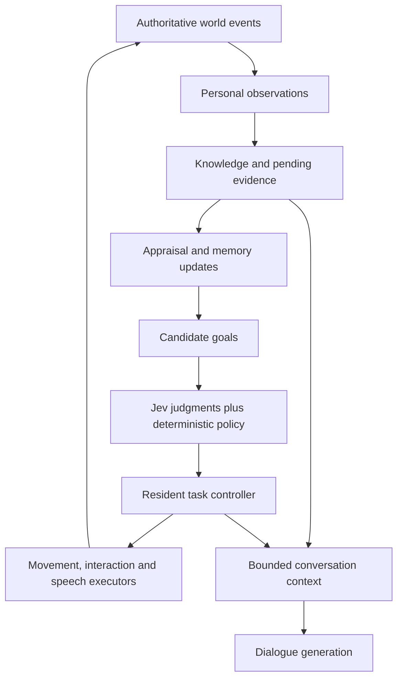

# NPC cognition and behavior implementation plan

Status: proposed implementation plan; no gameplay implementation is authorized by this document alone.

Prepared against `0c0f7be` (`fix/town-emergency-flow`), following the cognition audit. Execute sequentially after the user requests implementation. Do not create another task or use subagents without explicit user authorization.

## 1. Outcome and scope

Build believable residents whose actions, knowledge, memories, feelings and speech agree, and whose behavior can be extended without adding cross-system exceptions. The town must continue functioning when providers are slow or unavailable.

The selected architecture is **scored goals, explicit interruptible tasks, personal knowledge, and narrow model judgments**, retaining the existing physical actor state machines and navigation. This follows the architecture proposed in the audit and the user's request to plan all of it.

The implementation includes:

- One owner for each resident's current task, movement intent and interruption/resumption rules.
- Personal evidence and beliefs used consistently by behavior and dialogue.
- Reliable observation processing, bounded working memory, durable memory, and useful forgetting/consolidation.
- Relationships with any person; temporary emotions, needs and actionable commitments.
- Jev appraisal and goal judgments with explicit contracts, scheduling, cancellation and fallbacks.
- Routines, sleep, social encounters, guard enforcement, body reporting/recovery and burial using the same task lifecycle.
- Versioned save migration, task continuation, decision traces, Remote Inspector views and scenario tests.
- Profiling and controlled evaluation of behavioral and speech variety.

Preserve Godot 4.7.1, typed GDScript, the existing Node/Express backend, Jev, and the configured OpenAI dialogue provider. Keep credentials local. Use mocks for automated development and validation; a live evaluation is a separate, explicit operation.

### Constraints and non-goals

- Preserve named NPC IDs, Den's identity, existing families, saved seed, town geometry, personalities, voice profiles, deaths, memories, relationships and economy data. Do not reset the real save.
- Preserve actor child names from `AGENTS.md`, existing collision geometry, physical combat state machines, attack spacing, doors, cameras and pixel-perfect UI. Integrate through narrow actor methods.
- Keep `/root/DialogManager` a UI/conversation boundary. Keep `/root/NpcCognition` as the composition root for persistent cognition and provider services; do not add another global manager.
- Economy remains simulation/data only. No trading UI, arrest/prison system, new town expansion, new assets, new player mechanics or medical simulation.
- Creature enemies retain their current combat AI; shared movement/contact regressions must still be tested. Do not give every monster the full resident mind.
- Do not introduce a general GOAP planner, external behavior-tree framework, ECS conversion, vector database, distributed event system, generic dependency-injection framework or a class for every primitive value.
- Do not promise arbitrary player requests as executable tasks. Only supported capabilities can become actionable commitments; other promises remain attributed prospective memories.
- Preserve unrelated working-tree changes. At planning time these include authored scenes/resources, theme, animation frames, `project.godot` and `docs/npc_memory.md`. Inspect the live diff before editing any of those files.
- Follow the local Godot skill already authorized by the user. Read `AGENTS.md`, `.github/skills/godot-gdscript/SKILL.md` and applicable nested instructions before implementation.

### Product defaults proposed by this plan

These are explicit initial tuning choices, not claims about human psychology. They can be adjusted during the behavior review without changing the architecture:

1. The simulation advances only while the game is running. No real-time offline aging or surprise events on load.
2. Routines are obligations and preferences. Immediate safety and physical incapacity may interrupt them; a minor sound is not automatic flight.
3. Residents know familiar places and the town's general roles. They do not know everyone's live location, private emotions, private inventory or unreported death.
4. Hunger, fatigue and social need influence choices. Pain derives from actual injury. This pass does not add starvation damage, healing, or resource consumption beyond existing economy rules.
5. Guards retain warnings, intervention against witnessed ongoing violence, and surrender. A body or anonymous sound never identifies a murderer.
6. Known bereavement creates a persistent concern and a temporary emotional response. Burial does not instantly erase grief, duties or memories.
7. Randomness is seeded and sampled at meaningful decisions, not every frame. Existing personalities are never rerolled by migration.

## 2. Current-state evidence

The audit found these contracts and coupling points; recheck them against the implementation branch before changing code.

| Evidence | Consequence | Planned correction |
| --- | --- | --- |
| `game/world/life/town_life.gd::_process()` chains watch, funerals and safety handlers | Control priority depends on call order | Candidate goals plus one task owner |
| `NpcDailyRoutine.hold(bool)` is called by safety, funerals and encounters | A caller can release another caller's pause | Task/session-owned claims and idempotent release |
| `TownBuildings._journeys`, `TownWatch._investigations`, saved person activity and runtime routine overlap | Continuation and interruption rules are scattered | Saved task checkpoints; movement is an executor |
| `TownFunerals._report()` scans actual guard positions | A witness can act on unobserved information | Last-known location, known patrol places and local discovery |
| `NpcMemoryStore.record_observation()` caps all observations at eight | Pending important evidence can be evicted | Dedicated evidence inbox, separate attention window |
| `commit_observation()` marks failures unavailable with no retry | Provider outages can prevent durable appraisal | Retry/deferred state with preserved evidence |
| Event memory construction assumes hearing means fighting and drops other participants | Incorrect cues and poor person-based retrieval | Typed observation kind, modality, provenance and entities |
| `TownDeaths.transition()` validates stage names but not transitions | Lifecycle invariants depend on callers | Intent-specific transition methods |
| `NpcCognitiveContext.build()` selects player-related concerns | Other relationships and events lack equal standing | Subject-based concerns and relationship graph |
| `complete_intention()` has no production gameplay caller | Remembered intentions do not drive or resolve actions | Commitment IDs linked to supported task outcomes |
| Separate conversation generations, actor revisions and social session tokens | Stale-result protection is inconsistent to extend | Decision tickets with explicit read versions and ownership |
| Per-observer processing calls full save writes | Event bursts amplify persistence work | Dirty checkpoints and coalesced saves |

Four isolated Godot probes reproduced: pending death evidence eviction after eight newer observations; body-report memories with a fighting cue and no structured people; classifier failure leaving no pending work; and direct `fallen → buried` transition without recovery. These establish current behavior, not a live-provider accuracy evaluation.

Keep the existing strengths: bounded imperfect recall, source-aware rumor chains, deduplication, atomic save replacement/validation, conversation commit guards, semantic grounding of generated memories, stable voice profiles, and shared route/contact handling.

## 3. Ownership and execution model



### Ownership table

| Owner | Authoritative state | May not do |
| --- | --- | --- |
| Existing actors/world services | Position, health, physical state, doors, bodies, economy, world time | Let generated text change facts |
| `NpcMindState` per NPC, held by `NpcMindStore` | Knowledge, directed relationships, condition, concerns, commitments, task checkpoint, decision sequence | Hold scene nodes or provider clients |
| Existing `NpcMemoryStore` | Archived recollections and conversation history, indexed by NPC ID | Own a second mutable copy of relationships or task state |
| `NpcBrain` child of each resident | Coordinates that resident's perceptions, candidate goals and one task controller | Scan the world registry for unknown targets |
| `NpcTaskController` | Current task, suspended continuation, claims, task generation | Let an old completion callback modify a replacement task |
| Existing `TownLife` | Clock, resident registration, place directory and tick orchestration | Choose a winner by calling competing movement handlers |
| `NpcDecisionService` | Queue, tickets, deadlines, provider handles and outcomes | Commit game state on its own |
| Existing `TownWatch`, `TownFunerals`, `TownEncounters` | Role opportunities, shared processes and encounter sessions | Bypass the task owner to change locomotion or sleep |
| `NpcSaveCoordinator` | Dirty state and consistent checkpoint scheduling | Maintain a competing game-state model |

`NpcCognition` composes the stores/services and owns their lifecycle. `TownLife` attaches resident-only `NpcBrain` nodes after profiles, navigation and saves are ready. `BaseNpc` exposes physical capabilities and delegates high-level intent. Do not add a brain to every base NPC scene just to reach townspeople.

Use `Resource` for authoring/tuning, `RefCounted` for typed records and task policy, and `Node` only for scene/runtime ownership. JSON and loose dictionaries belong at serialization boundaries and temporary legacy adapters. Existing archive dictionaries may remain inside `NpcMemoryStore` while its public mutation methods enforce invariants.

### Task contract

Every task has `task_id`, `kind`, `phase`, `status`, `started_minute`, optional `deadline_minute`, evidence/commitment references, required claims, a validated parameter record and serializable progress. Statuses are `CREATED`, `RUNNING`, `SUSPENDED`, `COMPLETED`, `CANCELLED`, `FAILED`.

The lifecycle methods are `start`, `advance`, `suspend`, `resume`, `cancel`, and `checkpoint`. Only the controller invokes them. `NpcTaskResult` reports `RUNNING`, `COMPLETED`, `BLOCKED` or `FAILED` plus a stable reason code; blocked work has a retry condition and timeout. A task must never await a provider while holding the physics update.

Start with a single foreground task and at most one resumable suspended task. Persistent unfinished goals live in commitments, not an unbounded stack. On a second interruption, preserve the displaced commitment if meaningful and rebuild its task later. Do not serialize live path arrays, node references, coroutines or HTTP requests.

Claims initially cover locomotion and conversational attention. Each claim records its task/session owner. Release is conditional on owner identity and idempotent. Body carriage is a separate claim enforced by `TownDeaths`; it is not a generic new resource framework.

The physical state machine remains responsible for hurt/attack/death animation and movement constraints. Death cancels all work. Temporary hurt prevents movement immediately and reports an interruption to the controller. Reflexes never wait for Jev. High-level response then uses perceived circumstances and task policy.

| Interruption | Required behavior |
| --- | --- |
| Death | Cancel tasks, conversations, tickets and claims; record remains once |
| Physical hurt | Immediate existing physical reaction; suspend/cancel according to task policy |
| Credible imminent danger | Interrupt ordinary/social tasks; preserve meaningful unfinished commitments |
| Unknown noise while asleep | Timed stirring/orientation; identity remains unknown; repetition does not restart the phase forever |
| Player conversation | Acquire a session only if the NPC is available; urgent duties may delay/refuse |
| Ordinary schedule boundary | Request reconsideration; do not invalidate a safe atomic action midway |
| Task failure or blocked path | Report the reason, release claims, try a bounded alternative or defer the goal |
| Save/load | Revalidate saved task against present facts and personal knowledge; resume or end explicitly |

Ambient speech may coexist with movement when allowed, but cannot overlap another utterance or interrupt protected speech. It uses a speech/session token; it never becomes a second movement authority.

### Goal selection and stable behavior

Capabilities produce a bounded list of goals: rest, eat, work, school, patrol, socialize, visit, investigate a perceived disturbance, seek safety, help a known relative, report a discovery, enforce a witnessed incident, recover remains, and visit a known grave. Only implement goals supported by existing world interactions or the tasks specified here.

Separate hard feasibility, urgency, and preference. Death/incapacity and missing capabilities are hard constraints. Needs, commitments, personality, relationships, deadlines and perceived danger influence scores. A route may discover that a believed destination is inaccessible or a person absent; that failure updates knowledge instead of granting advance omniscience.

Use an explainable score breakdown and a switching cost for abandoning current work. Initial ordinary commitment minimum: 5 game minutes; ordinary replacement requires a 0.15 advantage on normalized goal scores. Urgent new evidence bypasses these two limits. Treat those numbers as calibration defaults in `NpcBehaviorTuning`, with tests for stability rather than universal personality outcomes. Seed tie-breaking by world seed, NPC ID and saved decision sequence.

Keep candidate generation with its domain: routines offer schedule activities, conditions/commitments offer personal goals, watch offers guard duties, funerals offer reporting/recovery opportunities, and encounters offer a nearby social invitation. Each returns `Array[NpcGoal]` from an explicit personal-knowledge projection. `NpcGoalSelector` accepts these candidates and scores/selects them; it does not become a new large dispatcher containing every role's conditions. A goal records stable ID, task kind, subject, evidence references, known destination, urgency, deadline and score inputs. Adding a goal changes its source/task and tests, not `TownLife`'s priority order.

## 4. Public contracts and file map

All paths marked **new** are proposed additions. Existing paths are extension/migration targets. Add files when their first consumer is implemented; do not scaffold empty layers.

| Files | Responsibility and public boundary |
| --- | --- |
| **new** `game/actors/npcs/cognition/npc_brain.gd` | `NpcBrain`: `receive_observation(observation: NpcObservation)`, `advance(minutes: float)`, `request_conversation(session_id: String) -> bool`, `finish_conversation(session_id: String)`, `debug_snapshot() -> Dictionary` |
| **new** `.../npc_mind_state.gd`, `.../npc_mind_store.gd` | Per-person state and lookup; `get_mind(id: String) -> NpcMindState`; validated `to_data()`/`from_data()`; mutations increment only relevant versions |
| **new** `.../npc_observation.gd`, `.../npc_evidence_inbox.gd` | Typed immutable-by-convention observation; enqueue, claim work, complete, defer; evidence cannot be rewritten by provider output |
| **new** `.../npc_knowledge.gd`, `.../npc_relationship_graph.gd` | Provenance/last-known facts and directed relationships; read projections are copies; updates require evidence IDs |
| **new** `.../npc_condition.gd`, `.../npc_commitments.gd` | Needs/emotions/concerns and supported unfinished intentions; advance via simulation time and task outcomes |
| **new** `.../npc_goal_selector.gd`, `.../npc_goal.gd` | Feasible candidate generation and scored selection; no actual-world person lookup in goal scoring |
| **new** `game/actors/npcs/tasks/npc_task.gd`, `npc_task_controller.gd`, `npc_task_context.gd`, `npc_task_result.gd` | Lifecycle, controller, narrowly supplied runtime capabilities, terminal reasons and serializable checkpoints |
| **new** `game/actors/npcs/tasks/npc_routine_task.gd`, `npc_safety_task.gd`, `npc_social_task.gd`, `npc_guard_task.gd`, `npc_recovery_task.gd` | Concrete phases for existing behaviors; keep related steps together rather than one file per condition |
| **new** `game/resources/actors/npc_behavior_tuning.gd` | Initial thresholds, durations, needs rates, commitment hysteresis and processing limits; exported values with units |
| **new** `game/actors/npcs/cognition/npc_decision_ticket.gd`, `npc_decision_result.gd`, `npc_decision_service.gd`, `npc_decision_policy.gd` | Versioned requests, typed results, scheduling and deterministic application policy |
| **new** `game/actors/npcs/cognition/npc_context_builder.gd`, `npc_decision_trace.gd` | Shared bounded context projections and capped diagnostic trace |
| **new** `game/world/events/world_event_snapshot.gd` | Stable IDs, event time/location and frozen facts at publication; live scene references never cross the cognition boundary |
| **new** `game/world/persistence/npc_save_migration.gd`, `npc_save_coordinator.gd` | Explicit migration and consistent dirty checkpoints |
| Existing `game/actors/npcs/base_npc.gd`, `npc_cognition.gd`, `npc_alert_response.gd`, `npc_perception.gd`, `npc_perception_router.gd` | Physical capabilities/composition, typed perception and paced reflex integration |
| Existing `game/world/life/town_life.gd`, `town_life_state.gd`, `npc_daily_routine.gd`, `npc_routine_plan.gd`, `town_resident_schedule.gd`, `npc_temperament.gd` | Remove action authority and duplicate mental state; retain clock, schedule generation and route execution |
| Existing `game/world/life/town_encounters.gd`, `town_watch.gd`, `town_justice.gd`, `town_funerals.gd`, `town_deaths.gd`, `town_rumors.gd`, `town_economy.gd`, `town_population.gd` | Shared workflows, legal transitions, public knowledge and actual-work accounting |
| Existing `game/world/interiors/town_buildings.gd` | Task-owned journeys, route completion/failure and door transitions; no independent sleep decision |
| Existing `game/ui/dialog/npc_memory_store.gd`, `npc_memory.gd`, `npc_memory_retriever.gd`, `npc_conversation.gd`, `npc_cognitive_context.gd`, `npc_event_processor.gd`, `dialog_backend_client.gd`, `dialog_manager.gd` | Archive/retrieval and dialogue adapters; migrate processing and context to cognition, then remove redundant authority |
| Existing `tools/server/src/app.js`, `npc-decisions.js`, `town-life.js`, `dialogue.js`, `memory-grounding.js`, `npc-voice.js`; **new** `cognition-contract.js`, `cognition-routes.js` in that directory | Versioned transport and bounded questions; preserve generation/grounding/voice behavior; no world mutation |

`.../` in this table denotes `game/actors/npcs/cognition/`. No generated folders or script renames are required before their migration stage. Keep compatibility facades only while an identified caller still needs them.

### Evidence and knowledge schema

`NpcObservation` fields: `observation_id`, `origin_id`, `incident_id`, `observer_id`, `kind`, `modality`, `observed_minute`, `space_id`, perceived position if available, `participant_ids`, attributed source, text, topics, sensory cues, and narrowly typed perceived facts. Modalities distinguish `SIGHT`, `TOUCH`, `NOISE`, `SPOKEN_REPORT`, and `DIRECT_SPEECH`; hearing speech is not anonymous noise. Do not invent an attacker ID from an underlying hidden event. Inbox insertion validates and copies the record; subsequent producer mutation cannot change accepted evidence. Consumers receive read projections, not writable references to stored evidence.

Origin identifies one underlying event/account. Incident groups related events without merging independent witnesses or unrelated assaults. Initially aggregate repeated damage/noise from the same perceived participants and place within 10 game minutes; a new victim, death, surrender violation or stronger evidence remains a distinct escalation. Unknown participants never become identified merely through grouping.

Knowledge entries carry subject, predicate, value, source/evidence IDs, observation time, source confidence, and status (`OBSERVED`, `REPORTED`, `INFERRED`, `CONTESTED`, `SUPERSEDED`). Belief confidence is separate from source reliability, recall clarity, emotional intensity and Jev answer confidence. Conflicts preserve both evidence chains. Nobody learns a death solely because the world removed the actor.

### Decision ticket schema

`NpcDecisionTicket` fields: `request_id`, `npc_id`, `kind`, `task_id`, `task_generation`, `created_minute`, `deadline_tick_msec`, `read_versions`, `evidence_ids`, `candidate_ids`, `context_hash`, `protocol_version`, `prompt_version`. Read versions name only the parts consulted: knowledge, relationship subjects, condition band, task or conversation session. Time-sensitive requests also carry an explicit expiry/precondition.

Provider outcomes are `SUCCESS`, `UNAVAILABLE`, `TIMEOUT`, `INVALID`, `CANCELLED`, `STALE`. Cancellation settles the local handle once even when the transport emits no completion signal. The service reports an outcome; the owning brain/conversation validates the ticket and commits effects synchronously without an `await` between validation and mutation.

Appraisal tickets may still commit historical memory after their actor changes task, if the evidence remains pending and unprocessed. They may not revive expired safety actions or old speech. Goal and speech tickets require their original task/session context to remain relevant. This distinction avoids discarding durable evidence because an NPC moved.

### Jev question contracts

Use stable question IDs and closed choices. Build subject/candidate-specific IDs from validated IDs, never from arbitrary free text. Version the question definitions with their contract fixtures.

| Request | Judgments | Application rule |
| --- | --- | --- |
| Event appraisal | `immediate_danger` Noul; `remember` Noul; `importance` Score; `fear`, `anger`, `grief`, `relief` Scores for the present event | Current safety uses only fresh relevant evidence; memory may commit later; emotion scores express intensity, not certainty |
| Subject disposition | For each evidenced subject and relevant dimension, `direction` Choice (`NEGATIVE`, `UNCHANGED`, `POSITIVE`) and `magnitude` Score | Confidence gates changes; magnitude is separate from general memory importance; game policy applies incident budget/receipt and preserves numeric limits |
| Goal assessment | One `suitability` Score per supplied goal; optional candidate-specific `duration` Choice (`BRIEF`, `ORDINARY`, `EXTENDED`) | Selector combines judgments with named needs/obligation/switching components; durations map to task-specific bounded game-minute values |
| Social invitation | `engage` Noul; `topic` Choice over supplied topic IDs plus `SMALL_TALK`; `tone` Choice over the current supported tone set | Session owns availability; topic must be known and permitted to share; no transfer until delivery |
| Listening | `believe_account` Noul; `remember` Noul; `importance` Score; relevant disposition questions | Bound belief by source/provenance, prevent repeated-origin corroboration, and avoid blaming the messenger automatically |
| Player speech | Existing intent Choice with `OTHER`, farewell Noul, memory/belief gates and response-mode Choice | Retain explicit present-tense surrender/farewell interpretation and reject quotations, negation and hypothetical cases |
| Optional utterance | `speak` Noul and intent Choice from the supplied valid intents | Candidate intents include warn, protest, check on someone, request help, report, acknowledge, decline, farewell and silence; code permits only those supported by current evidence/task |

Scores use five ordered levels with concrete criteria for each question: for emotion, absent/mild/clear/strong/overwhelming; for suitability, inappropriate/weak/plausible/good/compelling. Keep the SDK's zero-based score handling explicit. Do not use a Noul probability as an emotional intensity. Initial admission/retrieval/belief gates retain existing 0.70/0.50/0.80 values until corpus calibration; disposition/action Choice gates start at 0.65, farewell at 0.80. These are tunable defaults, not demonstrated accuracy claims.

Per-dimension disposition magnitude maps initially to 0, 0.025, 0.05, 0.075, 0.10. Track the amount already applied for that incident/subject/dimension and apply only new justified escalation, not that entire amount per hit or retry. Conflicting/corrective evidence creates an explicit revision with its own source; it cannot oscillate feelings through repeated reevaluation of unchanged input. Familiarity changes through distinct delivered interactions and bounded exposure policy rather than a positive increment on every provider request.

If an utterance or goal depends on newly applied appraisal results, build its request after those results are committed. A sibling question in the original batch cannot implicitly consume them. Preserve the separate post-generation semantic grounding check for proposed memories.

### Relationship and commitment contracts

Use one directed graph keyed by stable subject ID, including `player`. Preserve the six existing dimensions and numeric ranges. Missing resident fear/respect/suspicion migrate as neutral, not inferred from family or profession. Relationship fear means a learned disposition toward that person; condition fear means current activation in a situation. Label both clearly in context/inspector rather than presenting two interchangeable fear numbers. Family roles remain population facts; affection and trust are subjective and can diverge between two people.

An evidence receipt prevents applying the same disposition change twice. Repeated hits in one incident can escalate harm with diminishing incremental effects; greeting repetition cannot indefinitely farm familiarity. Routine fear/arousal decay does not automatically restore trust. A daily clamp limits repeat-small-talk familiarity gain; meaningful new encounters may exceed it through explicit policy.

Commitments carry ID, owner, beneficiary/other parties, kind, evidence IDs, creation/deadline, priority, status and optional task ID. Supported kinds in this pass: report a discovery, check a known relative, attend an existing work/patrol obligation, visit a known grave. Task success resolves by commitment ID exactly once. Imported prospective memories have no invented executable kind or completion state.

## 5. Persistence, failure and compatibility design

### Save ownership and versions

Keep the current `user://npc_world.json` untouched as the legacy source. The new default is `user://npc_world_v2.json`, root schema version 2. Tests must override both candidate paths before loading the world. If v2 exists but is invalid, report a load failure and prohibit writes; do not silently fall back to an old world or create an empty one.

The v2 root contains:

- `version: 2` and migration metadata (`source_version`, source digest, migration revision).
- Existing world seed, authoritative deaths/remains, population, economy and justice records, with their validated subversions.
- Simulation clock, stable event/incident counters and plans/positions.
- `minds`: per-NPC knowledge, directed relationships, condition, commitments, pending evidence, receipt state, task checkpoint and decision sequence.
- `memory`: existing stable memory IDs/archive contents plus timestamped conversation sessions and revised provenance fields.

Do not save HTTP handles, request deadlines based on machine ticks, live routes, claims referring to scene nodes, or incomplete generated text. Save decisions already applied and evidence still awaiting appraisal. Rebuild runtime requests after load from pending evidence and current context.

Migration is pure and validated before installation: `NpcSaveMigration.upgrade(source: Dictionary) -> Dictionary` returns an envelope with `ok: bool`, `data: Dictionary`, and `error: String`. Success carries the v2 candidate with an empty error; failure carries an empty data dictionary and a stable diagnostic. `NpcWorldSave.from_data()` validates all subobjects before replacing any live state. Migration is deterministic and idempotent for fixture inputs.

| Legacy field | Migration rule |
| --- | --- |
| Memory archive, IDs, authored memories, seed, personality and voice | Preserve values and identity; do not regenerate |
| `memory.npcs[id].relationship` | Move to that NPC's graph entry for `player`; retain a temporary read adapter |
| `life.people[id].ties` | Move to directed resident graph; default only missing dimensions |
| Observations with `pending` or `unavailable` | Preserve as pending/deferred evidence; do not declare remembered or reapply assessed deltas |
| `sense=hearing` | Infer a specific modality only from explicit event kind/source metadata; otherwise keep anonymous sound or unknown hearing provenance |
| Existing incorrect fighting cues | Remove only when explicit body-report metadata proves the cue wrong; do not rewrite unverifiable history or fabricate participants |
| Assessed observations and heard-origin receipts | Import processed receipts so migration/retry cannot repeat disposition changes |
| Saved safety concern | Import with remaining simulation-time lifetime; expired concerns stay historical |
| Saved activity/place/until | Reconstruct an ordinary task if valid; otherwise explicitly replan from the saved position |
| Runtime-only investigation/journey progress | Do not pretend it was saved; use stored justice evidence/known destination where available, otherwise replan |
| Death stages and carrier/reporter IDs | Validate references, reconstruct eligible shared process, and preserve the actual body location |
| Known-by/burial-known-by lists | Import attributed knowledge for those NPCs only; no town-wide broadcast |
| Prospective memories | Preserve uncompleted status; add executable commitment only where the old data proves a supported kind |
| Recent dialogue lacking dates/session IDs | Mark a legacy session with unknown time; never label it as a fresh exchange |

On reload, validate every task's actor, space, target, phase, role, evidence and shared claim. Missing targets produce a recorded cancellation/replan. A dead carrier leaves remains at the last authoritative carried position; a missing reporter releases the report assignment for later discovery. Loading a checkpoint must not create another corpse, grave, relationship delta, wage settlement or utterance.

### Rollback

- Before first real-save use, migrate a copy and compare semantic inventories: all NPC/memory IDs, dead IDs, seed, personality values, family graph and balances.
- Write v2 to a temporary file, flush, then atomically replace v2 using the existing save approach. Never overwrite legacy v1.
- Rolling code back to the pre-migration commit uses preserved v1. Progress made exclusively in v2 will not exist in v1; document this explicitly. Do not implement a lossy reverse migration or automatically delete either file.
- During development, fixtures and isolated saves are the default. Record the exact last-good commit and fixture version at each milestone.
- Do not perform an irreversible conversion/reset of the user's running world. Normal migration creates a new file and leaves the source recoverable.

### Failure behavior

| Failure | Required outcome |
| --- | --- |
| Jev unavailable | Physical safety remains responsive; routine uses deterministic local scoring; speech may remain silent |
| Dialogue unavailable | Release/wind down session cleanly; do not invent dialogue, commit a proposed promise, or transfer an unspoken rumor |
| Appraisal unavailable | Keep evidence with status/attempt count; retry with backoff; do not apply invented relationship changes |
| Stale goal/speech response | Drop with reason, release only its request resources, and reconsider if still useful |
| Invalid/malicious provider payload | Validate enum/IDs/ranges/evidence references and reject atomically; no partial mutations |
| Unreachable destination | Bounded rerouting followed by blocked/deferred goal; preserve important commitments |
| No living available guard | Witness follows known search opportunities, then defers reporting; ordinary safety/routines remain usable and body remains discoverable |
| Interrupted shared conversation | Both owners release the same session idempotently; late speech transfers no information |
| Save failure | Keep dirty state, report failure, retry; never claim durable success or overwrite a corrupt source |
| Scene teardown | Settle local handles, release claims and cancel runtime work; no awaiters stranded on freed nodes |

For pending evidence, use a small fair dispatch window, not destructive queue truncation. Initial window: 32 ready items per resident; further protected evidence stays in the serialized inbox. Coalesce redundant low-information noise by incident, keeping count, first/last times and strongest observation. Never drop distinct direct injury, death discovery, identified assault or commitment evidence to make room for noise. Record all deliberate low-priority coalescing in diagnostics. Processed transient envelopes may expire after their durable effects and receipts are committed; pending critical evidence cannot expire merely because the provider is down.

## 6. Implementation milestones

Dependency order: **M0 → M1 → M2 → M3 → M4 → M5 → M6 → M7 → M8 → M9 → M10**. Work on one milestone at a time. Each numbered item below is a small red/green task; split further at the named interfaces when needed. Finish an executable slice before continuing. Do not commit intentionally failing tests.

Every milestone records completed tests, changed files, remaining migration adapters, and the next step in **new** `docs/plans/npc-cognition-progress.md`. This is implementation continuity, not a second design document. Commit/push completed slices on the implementation feature branch per `AGENTS.md`; do not auto-merge or create a PR unless requested.

### M0. Baseline, fixtures and behavioral contracts

**Files:** existing tests listed in section 8; **new** `tests/fixtures/npc_simulation_fixture.gd`, `tests/fixtures/npc_fake_decision_service.gd`, `tests/unit/npc_cognition_regression_test.gd`; fixture save files under **new** `tests/fixtures/cognition/`.

1. Capture current unit, backend and relevant integration results plus commit SHA. Keep existing failures separate from new ones; reproduce any combat/contact failure before attributing it to this work.
2. Create a reusable isolated simulation fixture with an explicit clock, deterministic random sequence, fake provider, resident lookup and task trace. It must set temporary save paths and fake endpoints before world instantiation; no real keys or real save are needed.
3. Encode the four audit probes as regression cases. Retain their current-behavior characterization only until the corresponding new contract lands; at that point assert the corrected behavior. Never keep a test that blesses evidence loss as the intended final contract.
4. Add fixtures for empty legacy worlds, the expanded town, dead/recovering/carried/buried residents, pending observations, rumor receipts, unusual voices, invalid schema and missing optional legacy fields. Use synthetic data, not copies of private player conversations.
5. Add scenario assertions for one locomotion owner, no information without evidence, and no effects repeated after reload. Assert externally visible task status/event outcomes, not only private dictionaries.

**Exit:** reproducible baseline and isolated fixtures; audit issues demonstrated; all committed baseline tests green or independently documented existing failures.

**Commit:** `test(cognition): establish isolated behavior and migration fixtures`.

### M1. Owned mental state and migration scaffold

**Files:** `NpcMindState`, `NpcMindStore`, `NpcRelationshipGraph`, `NpcCommitments`, `NpcSaveMigration`, `NpcWorldSave`; **new** `tests/unit/npc_mind_state_test.gd`, `npc_save_migration_test.gd`.

1. Add directed relationships with evidence receipts and private owned records. Port existing validation/ranges from `NpcRelationshipState`; use explicit operations instead of exposing writable nested dictionaries.
2. Add the minimal mind record and component version counters. Include neutral condition/knowledge sections that later milestones fill; no simulated needs behavior yet.
3. Implement pure v1-to-v2 migration and atomic validation. Test idempotence, preservation of stable identities/numeric values, refusal of unknown future versions and no partial installation on one malformed NPC.
4. Wire legacy relationship/ties reads through adapters backed by the new single owner. Remove dual writes in the same commit; old serialization remains readable through migration, not a second mutable authority.
5. Add task-checkpoint schema validation and decision-sequence persistence without enabling a new controller yet.

**Exit:** fixtures round-trip in v2 with zero lost NPCs, memories, families, deaths or balances; legacy file remains byte-identical; current dialogue behavior still passes.

**Review checkpoint:** inspect migration diff/inventory and a sample saved mind. Surface any legacy ambiguity rather than inventing history. Real-save use remains reversible through the preserved v1 file.

**Commit:** `refactor(cognition): own resident mental state and migrate saves`.

### M2. Personal evidence and knowledge boundaries

**Files:** `WorldEventSnapshot`, `NpcObservation`, `NpcKnowledge`, `NpcEvidenceInbox`; existing `world_event.gd`, `world_events.gd`, `npc_perception.gd`, `npc_perception_router.gd`, `npc_cognition.gd`, `town_population.gd`, `town_rumors.gd`; **new** `tests/unit/npc_knowledge_test.gd`, `npc_evidence_inbox_test.gd`.

1. Freeze event IDs, world time, location and factual payload at publication. Existing physical consumers may temporarily retain live actor references; perception must immediately construct a value-only observation before any asynchronous work.
2. Split noise from attributed speech and preserve participants/topics/cues. Add body discovery/report/burial and ordinary conversation adapters. Unknown evidence stays unknown rather than defaulting to combat.
3. Bootstrap residents' public town knowledge from stable identities, family roles and familiar public places. Do not seed live positions, private knowledge, actual hidden deaths or private household balances of other families.
4. Track last-seen locations with timestamps and explicit updates from reports. Expose `known_locations(subject_id)` and `known_help_places()` as copied projections. Seeking somebody uses this projection and local perception.
5. Move pending processing out of the eight-entry display/working-memory array into the inbox. Claim processing per observation ID; success/failure/defer methods are idempotent. Preserve failed work and migrate unavailable observations.
6. Add explicit contradiction handling: a later firsthand sighting may supersede an older location report; repeating the same origin is not corroboration; conflicting reports remain contested. No vector search or semantic claim graph is required.

**Exit:** the death-plus-eight-noises test preserves death evidence; hearing a report produces speech provenance and named retrieval entities, no fighting cue; freeing/moving an actor cannot change an already published observation. Behavior-facing knowledge cannot reveal a hidden guard position.

**Commit:** `refactor(perception): preserve personal evidence and bounded knowledge`.

### M3. One task owner; routines, sleep and safety

**Files:** `NpcBrain`, task base/controller/context/result, routine/safety tasks, `NpcBehaviorTuning`; existing `base_npc.gd`, `npc_alert_response.gd`, `npc_daily_routine.gd`, `town_life.gd`, `town_life_state.gd`, `town_buildings.gd`; **new** `tests/unit/npc_task_controller_test.gd`, `npc_routine_task_test.gd`, `npc_safety_task_test.gd`.

1. Implement task state transitions and owner-checked claims. A terminal task cannot resume; duplicate completion/cancellation is harmless. Test invalid transitions before binding actors.
2. Implement a narrow executor boundary: `TownBuildings.begin_task_travel(npc, npc_id, space_id, point, owner_task_id)`, `cancel_task_travel(npc_id, owner_task_id)`, and completion/failure notifications with owner ID. Type all arguments in GDScript. A stale cancellation must not remove a newer journey.
3. Convert existing routine travel/rest/work/patrol behavior to controller-owned tasks. Move sleep entry out of `TownBuildings.advance()` into the rest task after arrival. Wake and task context must agree before dialogue becomes available.
4. Integrate timed stirring/orientation with the safety task and existing physical hurt reaction. Test asleep, awake, injured, threatened-at-home and repeated-noise cases. Danger in one's own home must not select that room as a refuge automatically.
5. Adapt every remaining movement caller (watch, funerals, social sessions) through temporary explicit task requests before enabling a resident brain. These adapters are removed in M4/M5. A migrated resident must never run both old and new authorities in a frame.
6. Restore checkpoints by revalidating destinations and rerouting from the actual saved position. A paused task's timer cannot extend past mandatory expiry or be reset by every loop.
7. Keep `ActorRoute`, `ActorCrowd`, `NpcPursuit`, hit/hurt boxes and attack range tuning unchanged. Run the real movement/contact integration tests at this boundary.

**Exit:** sleep → noise → orient → investigate/shelter → resume is consistent; conversation/encounter release cannot release safety's claim; saves do not leave residents indefinitely asleep or traveling without an owner. Remove `NpcDailyRoutine._held` once its last caller is migrated.

Preserve the current pacing at the default simulation speed: initial stirring takes 2–5 game minutes and orientation 1–3, with saved per-occurrence seeded variation influenced by alertness. Physical hit response remains immediate. Express task waits in game minutes and UI/animation timing in real seconds; do not mix units in a shared numeric field. Pausing the simulation pauses story progress and needs, while request timeouts may still settle safely.

**Commit:** `refactor(npc): centralize task ownership and interruptions`.

### M4. Conversations, shared encounters and commitments

**Files:** social task, `NpcCommitments`; existing `town_encounters.gd`, `npc_conversation.gd`, `dialog_manager.gd`, `base_npc.gd`, `npc_ambient_history.gd`; **new** `tests/unit/npc_social_task_test.gd`, `npc_commitment_test.gd`.

1. A two-person encounter reserves both participants in stable ID order through their task owners. If either declines/is interrupted, release the other immediately. Session ID is required for every release and speech result.
2. Request consent/availability before movement stops. Avoid holding two residents still for a long model request that may ultimately reject the encounter; use a short approach/acknowledgment phase and a bounded invitation timeout.
3. Distinguish approaching, conversing and leaving phases. Preserve deliberate pauses and alternating speakers; stop inventing knowledge transfer before audible delivery. Offscreen abstraction may transfer an account only after the simulated exchange reaches its delivery step.
4. Route player dialogue acquisition/close/farewell/surrender through the same availability and interruption boundary. Keep existing input, varied automatic greeting, NPC name display, punctuation normalization and generated-text grounding.
5. Add stable conversation/session IDs, speaker/listener IDs, game timestamps and delivery status to recent dialogue/social history. Old history is context of unknown age, not a current session.
6. Link supported intentions to explicit commitment IDs and task outcomes. Use `NpcMemoryStore.complete_intention()` only after the related gameplay completion is confirmed. Cancellation or failure must not mark a promise fulfilled.

**Exit:** crossing social invitations do not deadlock; player or danger interruption releases both participants; a late response cannot speak through a new conversation or share an undelivered rumor; a supported commitment completes once across reload.

**Commit:** `refactor(social): coordinate shared tasks and conversation lifecycles`.

### M5. Guard and funeral workflows

**Files:** guard/recovery tasks; existing `town_watch.gd`, `town_justice.gd`, `town_funerals.gd`, `town_deaths.gd`, `town_resident_schedule.gd`; existing emergency/watch integration scripts plus **new** `tests/unit/npc_guard_task_test.gd`, `npc_recovery_task_test.gd`.

1. Make shifts/patrol routes schedule data derived from role and saved assignment, removing the special-case guard ID from execution. Preserve staffed night patrol and ordinary off-duty life.
2. Express investigation, warning, intervention, pursuit and surrender as guard task phases. Escalation consumes the guard's own admissible evidence. A report can cause investigation but cannot by itself authorize attacking an unseen named suspect.
3. Body reporting searches last-known guard locations, familiar patrol points or a known guard home. If a guard is visible, approach the perceived location; reacquire locally if the guard moves. No global nearest-living-guard query in the witness's decision path.
4. Replace writable `TownDeaths.records`/generic transition calls with snapshots and intent-specific methods: `discover`, `claim_report`, `acknowledge_report`, `begin_recovery`, `pick_up`, `drop`, `bury`, `release_assignment`. Return success/reason and enforce prerequisites, ownership and body location inside this owner.
5. Encode allowed transitions: `fallen → discovered → reported → recovering → carried → buried`; a discovering guard may acknowledge their own report. Interrupted recovery returns to reported; dropped carriage returns to reported at the physical drop point. Reporter loss before acknowledgment releases the claim without erasing other witnesses' knowledge. Buried is terminal.
6. Task phases: absorb discovery, seek help, report/acknowledge, reach body, assess immediate safety, prepare, carry, reach cemetery, bury. Use simulation time for progress and actual completion events for arrival. Preserve the body until pickup and the grave after burial.
7. Handle no guard, two witnesses, two guards claiming one body, combat while carrying, dead carrier, closed/unreachable route, missing reporter, and save/load in every phase. Known death/burial is projected from personal knowledge, including correctly attributed later reports.
8. Record bereavement concern for informed relatives without a town-wide knowledge broadcast. A grave seen later can teach burial status through perception; it does not reveal the killer.

**Exit:** complete realistic report/recovery/burial flow with exactly one body/grave, no unseen culprit inference, no witness stuck forever when no guard survives, and restored patrol/ordinary commitments after intervention.

**Commit:** `refactor(town): execute guard and burial duties as validated tasks`.

### M6. Memory, beliefs and incident-based appraisal effects

**Files:** evidence/knowledge/relationships/commitments; existing `npc_memory_store.gd`, `npc_memory.gd`, `npc_memory_retriever.gd`, `npc_event_processor.gd`, `town_rumors.gd`; **new** `tests/unit/npc_memory_consolidation_test.gd` and expanded existing memory/observation tests.

1. Separate inbox, working-memory projection, archive and belief updates. A short display window no longer controls admission eligibility. Admission and disposition updates consume stable evidence receipts transactionally.
2. Store event kind, entities, source, incident/origin and game time in new event memories. Preserve hearsay chains; “heard a report” and “saw the death” remain distinct even if they concern the same resident.
3. Apply dispositions per subject/incident with bounded escalation. Compare one assault represented by many hit events to one with fewer hits: total physical severity and evidence drive the outcome, not just callback count. New lethal escalation and surrender violation remain significant.
4. Introduce working-memory salience for any personally relevant subject. Include family losses, unresolved commitments and current duties; do not require `player_involved` to become a concern.
5. Improve retrieval first with normalized entity IDs, topic aliases, incident links, current goals and unresolved commitments, retaining bounded imperfect recall. Keep a paraphrase fixture set to measure lexical blind spots. Do not expose the full archive to Jev as a workaround.
6. Add conservative consolidation: group repetitive low-importance episodes sharing subject/type/source/incident, preserving evidence references and the strongest warranted uncertainty. Keep authored core memories, unresolved commitments, contested beliefs and consequential losses protected. Never merge independent accounts into false corroboration.
7. Define receipt compaction separately from forgetting: receipts outlive any replayable origin. Prune only after all inbox, rumor and commitment references expire and no supported replay can reintroduce the event. Test a save/reload rumor loop after the original memory is forgotten.
8. Keep detail decay/name recall behavior. Migrate unknown dates as unknown. Ongoing needs or grief must not manufacture sensory details missing from the evidence.

**Exit:** archive/working-memory policies are explicit and independent of queue load; repeated evidence cannot farm relationship changes; contested and forgotten information remains epistemically sound; supported intentions resolve by gameplay outcome.

**Commit:** `refactor(memory): separate evidence processing from recollection and belief`.

### M7. Unified decision service and provider contracts

**Files:** decision ticket/result/service/policy, behavior tuning; existing `dialog_backend_client.gd`, `npc_conversation.gd`, `npc_event_processor.gd`, `town_life.gd`, `town_encounters.gd`; backend files from section 4 and **new** `tools/server/src/provider-queue.js`; **new** `tests/unit/npc_decision_service_test.gd`, `npc_decision_policy_test.gd`, `tools/server/test/cognition.test.js`, `provider-queue.test.js`.

1. Implement `evaluate(ticket: NpcDecisionTicket, payload: Dictionary) -> NpcDecisionResult`, `cancel(request_id: String) -> void`, and `cancel_owner(npc_id: String) -> void`. Evaluation can be awaited by application flows, never a physics loop. All completion paths settle exactly once, release capacity and wake waiting callers.
2. Use one game-side scheduler with explicit urgency and per-NPC fairness. Initial transport limits: four judgment requests, two text requests; reserve availability for interactive work while aging background jobs so they cannot starve. Process one observation/incident batch per NPC turn instead of draining a busy NPC forever. Coalesce obsolete routine requests rather than queuing each tick.
3. Backend provider queue enforces actual upstream limits, including secondary memory-grounding calls nested in text requests. Game scheduling owns relevance; server scheduling owns provider concurrency. Avoid nested acquisition of the same permit and release permits on every error/disconnect.
4. Make request cancellation settle locally without depending on `HTTPRequest.request_completed`. Call `cancel_request()` and clean up the request node. Propagate cancellation through the backend to upstream SDKs when the installed SDK supports it; do not claim cancelling the client always stops provider billing. Test transports that complete after cancellation and those that never emit completion.
5. Use real monotonic time only for transport deadlines/backoff; use simulation time for story/task relevance. Initial budgets: 8 seconds for a judgment, 30 seconds for dialogue, 10 seconds for optional ambient text. Evidence retries after 2, 10 and 30 real seconds, then deferred until a successful health/recovery signal or a 60-second backoff. Retained evidence can be assessed later without producing old speech.
6. Standardize a v2 JSON envelope carrying ticket identifiers, protocol/prompt versions, bounded state and candidate/evidence IDs. Add `/v2/cognition/appraise`, `/v2/cognition/select-goal`, `/v2/cognition/social`, and `/v2/cognition/listen`; retain v1 routes only while callers migrate. Reject mismatched versions explicitly and fall back locally; never silently reinterpret another schema.
7. Backend returns validated typed judgments with `choice`, `score`, `noul`, answer confidence and distributions as appropriate. Godot `NpcDecisionPolicy` alone maps them to domain effects and authoritative thresholds. Remove duplicate JS relationship-delta application when the last v1 caller is gone. Shared synthetic JSON fixtures verify both sides' enum/range/ID contracts.
8. Decompose questions into event appraisal, goal suitability, listener belief and speech intent. Ask independent questions together. Do not ask an independent answer to reason about a sibling answer it cannot see. In particular, replace routine `linger` referring to an unseen selected activity with candidate-specific duration judgments or a subsequent bounded stage.
9. Validate candidate coverage and uncertainty. Include a safe fallback/defer option when appropriate; validate that returned IDs were supplied. Confidence is not fear intensity, moral certainty or memory truth. Apply low-confidence fallbacks consistently, including response mode and routine selection.
10. Validate/apply effects synchronously through the owner after ticket checks. Diagnostic-only changes must not invalidate a response; changed threat, relevant belief, session, target death or task ownership must. A cancelled/stale request cannot restore an old goal or duplicate relationship effects. Apply a resident's dependent historical appraisals in evidence sequence; independent requests can complete in any order. Replay fixtures control clock/deadlines and record accepted outcomes, so determinism is not falsely promised for different real-world provider latencies.
11. Replace unbounded `wait_for_assessment` before conversation with a bounded wait for relevant fresh evidence (initial maximum 2 real seconds). Pending evidence remains visible as unassessed context; the NPC does not forget an assault because the classifier is slow.

**Exit:** controlled slow/failing/invalid/reordered responses produce no stale effects or stranded reservations; all queues drain fairly; provider loss leaves daily life/safety operational; memory grounding participates in limits; mocks verify v1/v2 transition and rejection.

**Review checkpoint:** inspect a recorded request/response contract and cancellation/failure traces. This is reviewable evidence, not permission to spend money on live evaluation.

**Commit:** `refactor(ai): unify npc decisions and cancellable provider work`.

### M8. Needs, emotions, personality and goal selection

**Files:** `NpcCondition`, `NpcCommitments`, `NpcGoal`, `NpcGoalSelector`, behavior tuning; existing `npc_temperament.gd`, `town_resident_schedule.gd`, `town_economy.gd`, task implementations; **new** `tests/unit/npc_goal_selection_test.gd`, `npc_condition_test.gd`.

1. Advance hunger, fatigue and social need using elapsed game time and actual task participation. Pain reads real injury; no second mutable health value. Sleeping/resting eases fatigue only after arrival and actual rest, not while walking toward a bed. Meal participation eases hunger without introducing trading or new resource rules.
2. Add cause-linked fear, anger, grief and relief with finite ranges, onset/decay and subject/evidence references. Reappraising the same event may refine understanding but cannot repeatedly add the original emotional impulse. Trust/affection remain separately owned long-term dispositions.
3. Derive candidate priorities from needs, current concern, family ties, commitments, personality and schedule obligations. A frightened parent can prefer checking a known endangered child; a guard can prefer protecting someone over finishing a patrol leg. These are available tasks with feasible steps, not free-form LLM plans.
4. Integrate existing traits into attention/salience, evidence appraisal, goal weighting, social initiative, persistence and voice. Preserve stable voice choices across moods. Add no new random personality axes unless a named behavior consumes them.
5. Implement commitment minimum/switching threshold and saved seeded tie-breaking. Urgent danger bypasses inertia; trivial variation cannot switch a resident between work and socializing every tick. Use semantic condition bands for decision invalidation instead of changing a version on every tiny decay tick.
6. Work and patrol credit are based on confirmed task engagement and role eligibility. Suspended travel/conversation/safety time cannot earn work credit merely because an old activity string still says work. Preserve existing balances and wage/settlement rules.
7. Add actual task sequences for check-relative and visit-known-grave using existing travel/conversation interactions. Only known loss produces grief/visiting opportunities. If a target is absent, search last-known/familiar places and defer rather than telepathically locating them.
8. Save/load midway through a need/emotion/commitment update with fixed clock inputs and assert equivalent state. Repeated simulations with identical seed, provider fixtures and event order produce identical choices; different seeds can vary legitimate tie-breaks.

**Exit:** paired fixtures show understandable differences in attention, action and social choice; personality affects behavior before prose. Residents satisfy routine needs without jittering goals, while a meaningful event changes both actions and later dialogue.

**Commit:** `feat(cognition): connect needs emotions and commitments to goals`.

Initial tuning for M8 is explicit and centralized, so implementation does not invent incompatible scales: need values are 0 (satisfied) to 1 (pressing); hunger rises by `1/480` per game minute and a completed meal lowers it to 0.15; awake fatigue rises by `1/960` per minute and sleeping lowers it by `1/480` per minute; social need rises by `1/2880` per minute multiplied by `0.5 + sociability`, with a delivered meaningful exchange lowering it by 0.1. Clamp every update to the valid range. New/legacy minds start at hunger 0.25, fatigue 0.2 and social need 0.3; this is neutral initialization, not reconstructed history. Initial emotional half-lives after the cause is no longer active are fear 15, anger 60, relief 20 and grief 2880 game minutes. Appraisal sets the relevant emotion/intensity; the half-lives do not force every person to feel every emotion. An unresolved bereavement commitment/concern can persist after acute emotion eases. Calibrate these defaults with the daily-cycle/paired-personality scenarios before completion.

### M9. Consistent dialogue and inspectable reasoning

**Files:** context builder and decision trace; existing `base_npc.gd` Remote Inspector hooks, `npc_cognitive_context.gd`, `npc_conversation.gd`, `dialog_manager.gd`, `npc_ambient_history.gd`; backend dialogue/voice/routes; **new** `tests/unit/npc_context_builder_test.gd`, `npc_decision_trace_test.gd`, plus existing inspector/voice tests.

1. Build one bounded semantic snapshot for dialogue, event reaction, social speech and decisions. Each consumer receives only relevant fields: stable identity/voice, current task/phase, relevant needs/emotions/relationships, perceived evidence and bounded recalls. Strip private runtime diagnostics and unknown world facts.
2. Derive activity, destination, sleep/wake status and interruption reason from the task/actor authority. Remove conflicting saved/runtime activity projections. Include explicit world time and known session ages, so a 21:00 greeting cannot accidentally reuse a morning wake context.
3. Feed a bounded speech intent such as warn a visible attacker, ask a known person for help, acknowledge a report, or decline an interruption. Let the dialogue model express the intent in the saved voice. It cannot create a completed action, a new culprit, an unsupported promise or hidden knowledge.
4. Preserve direct NPC speech, normalized ASCII apostrophes/quotes, no em dash, concise bubbles, NPC names, farewell closure and anti-assistant wording. Do not flatten all personalities to one sentence length; retain bubble maximum width and integer font sizing.
5. Add v2 `/v2/dialogue/chat` and `/v2/dialogue/say` contracts with response, grounded memory proposals and used recall IDs where relevant. Remove compulsory generation of three suggested player replies from the free-input path. Preserve any existing authored-choice path through its own adapter until proven unused.
6. Replace hardcoded report/recovery speech with intent-driven optional lines plus short existing-style offline fallbacks where communication is necessary. When a report is simulated offscreen, commit its structured meaning at delivery; when audible generation fails before delivery, do not pretend its words were spoken. Keep both paths explicit in tests.
7. Expose read-only Remote Inspector groups for goal scores, selected task/phase, suspended task, claims, perceived threats, knowledge sources, needs/emotions, relationships, commitments, pending evidence, request outcomes and last save status. Keep expensive snapshots lazy and refresh only when selected or changed.
8. Record capped traces (initial 64 entries/NPC): game time, event/incident, selected/rejected goals and score components, task transitions, request versions/latency/outcome, effect receipts and save failures. Reasons come from observable policy inputs and codes, not requests for hidden chain-of-thought.

**Exit:** speech agrees with the same state that drives movement; names/quotes/fonts/farewell remain correct; a tester can explain why a resident is standing, fleeing, refusing, grieving or resuming work from the inspector alone.

**Commit:** `feat(debug): expose coherent npc context and decision traces`.

### M10. Persistence scheduling, scenarios, calibration and cleanup

**Files:** save coordinator, `NpcCognition`, `TownLife`, memory/index helpers as needed; **new** `tests/integration/npc_cognition_scenarios_test.gd`, `npc_cognition_soak_test.gd`, `npc_runtime_smoke_test.gd`, `tools/run_npc_cognition_checks.sh`, `tools/server/test/cognition-evaluation.test.js`, `tools/server/evaluate-cognition.js`, `tools/server/evaluation/cognition-cases.json`; documentation listed below.

1. Coalesce ordinary dirty writes with an initial 2-real-second debounce and a maximum 10-second unsaved window. Flush critical transitions (death, body pickup/drop/burial and explicit checkpoint) after all related synchronous changes are coherent. Snapshot task checkpoints and positions in the same world snapshot. Do not serialize once per observer in the perception loop.
2. Reuse cached public profiles and bounded context projections; avoid copying the full memory archive per request. Index memory candidates by entity/topic before ranking. Profile first before adding spatial indexing; if all-pairs social scanning is material, use an existing spatial partition or a simple per-space grid, not a new general spatial framework.
3. Add seeded end-to-end scenarios from section 8, using normal public commands/physics instead of force-setting tasks to the desired phase. Fixtures may place actors initially but should not teleport them between every workflow step.
4. Run an accelerated 7-game-day simulation with 35 residents and a stress run with 70 synthetic residents. Providers are deterministic mocks; record queue peaks, per-NPC wait distribution, evidence counts, save bytes/writes, task churn, memory growth and cognition CPU time. Include at least one 100-event burst and one provider outage/recovery.
5. Target cognition/task processing p95 below 2 ms/frame for the 35-resident reference scene on the same development machine; report hardware/configuration and before/after measurements. Treat unmet targets as optimization work, not a reason to weaken behavior tests. Save count for 100 noncritical same-frame events must be one coalesced ordinary checkpoint, not 100 observer writes.
6. Add a labeled provider-evaluation corpus and offline mocked contract tests. The live evaluator is opt-in via `--live`, refuses missing keys, accepts an explicit case limit, prints an estimated/request-count budget before execution and stores model/prompt versions with outputs. Do not run it as part of `npm test` or normal implementation verification.
7. Remove obsolete legacy mutators/flags/adapters after all callers migrate: shared `_held`, priority-chain movement control, duplicate relationships/ties, direct funeral/watch routing and dead generic lifecycle setters. Preserve compatible public actor child names and useful archive APIs. A code search must show no alternate high-level movement writer for residents.
8. Update `docs/town_life.md`, `docs/npc_perception.md`, `docs/npc_memory.md`, `docs/actor_dialog_development.md`, `docs/godot_testing.md`, `tests/README.md`, `tools/server/README.md`, and add `docs/npc_cognition_architecture.md`. Integrate the user's existing edits rather than replacing these files wholesale.

**Exit:** full acceptance matrix passes; ordinary saves are coalesced; real tasks survive reload; the old competing control paths are removed; extension recipe adds a new supported behavior through one goal/task boundary with no unrelated-system patching.

**Review checkpoint:** present behavioral clips/traces, migration inventory and performance figures. Dialogue quality remains explicitly unverified until a live evaluation/manual play session is actually run.

**Commits:** `perf(cognition): coalesce saves and bound simulation work`, then `test(cognition): validate integrated resident behavior`, then `docs(cognition): document ownership and extension recipes`.

## 7. Representative test contracts

These are implementation targets, not claims that the named new APIs already exist. Add them when their owning milestone lands. Keep fixture setup in test helpers and test public effects.

### Pending evidence survives attention pressure (M2)

Use `NpcEvidenceInbox.enqueue(observation: NpcObservation) -> bool`, `contains_pending(observation_id: String) -> bool` and `ready_count() -> int`. `NpcObservation` uses the fields/enums from section 4.

```gdscript
func test_death_evidence_survives_redundant_noise() -> void:
	var inbox := NpcEvidenceInbox.new()
	var death := NpcObservation.new()
	death.observation_id = "observer:death:1"
	death.origin_id = "world:1"
	death.incident_id = "incident:1"
	death.observer_id = "holt_partner"
	death.kind = &"body_discovered"
	death.modality = NpcObservation.Modality.SIGHT
	death.observed_minute = 1380.0
	death.space_id = &"home:garrin_holt"
	death.text = "I found Garrin dead."
	death.participant_ids = ["garrin_holt"]
	assert_true(inbox.enqueue(death))
	for index: int in range(100):
		var noise := NpcObservation.new()
		noise.observation_id = "observer:noise:%d" % index
		noise.origin_id = "noise:%d" % index
		noise.incident_id = "noise-incident:1"
		noise.observer_id = "holt_partner"
		noise.kind = &"disturbance"
		noise.modality = NpcObservation.Modality.NOISE
		noise.observed_minute = 1381.0
		noise.space_id = &"home:garrin_holt"
		noise.text = "I heard a repeated thud."
		inbox.enqueue(noise)
	assert_true(inbox.contains_pending("observer:death:1"))
	assert_true(inbox.ready_count() <= 32)
```

Also assert the protected observation round-trips, no unknown participant was added, coalescing retains a count, and a second enqueue with the same ID cannot create a second appraisal/effect.

### A spoken report has speech provenance (M2/M6)

Input: observer `vale_guard`, source `holt_partner`, deceased subject `garrin_holt`, kind `body_reported`, modality `SPOKEN_REPORT`, text “Mira told me she found Garrin dead. The cause is unconfirmed.”, topics `[death]`, and a successful remember judgment. Assert that the resulting memory retains Garrin and Mira as people, attributes the report, has no fighting cue, does not identify Den, and produces no player trust penalty. Sight of the body later is distinct supporting evidence, not another application of the original report's effects.

### Ownership survives delayed callbacks (M3/M7)

Start routine task `routine:1`; begin social session `social:1`; interrupt with safety task `safety:1`; deliver the old session's close, old travel completion and old Jev result in every permutation. Assert `safety:1` remains the locomotion owner, conversation claims are empty, old results are `STALE`, and no displaced route resumes until the safety task explicitly ends. Repeat with death and with scene teardown; all tickets must settle exactly once.

### Lifecycle transitions reject missing prerequisites (M5)

Create fallen remains for Garrin. Calling `bury` before discovery, acknowledgment and pickup returns failure and leaves the record unchanged. After valid discovery/report/recovery, two guards attempt pickup; exactly one succeeds. Kill that carrier; exactly one body exists at the drop position. Reload and finish burial; exactly one grave exists and a repeated `bury` call cannot duplicate it. Validate these outcomes through public snapshots and emitted facts.

### State versions invalidate only relevant work (M7)

A goal ticket reads task, knowledge and a relationship with Mira. Adding a diagnostics entry or changing an unrelated resident's relationship does not stale it. A newly perceived attacker, Mira's reported death, a relevant schedule boundary or replacing its task does. An old appraisal may still create an attributed memory exactly once while its accompanying optional utterance expires.

## 8. Verification and acceptance matrix

### Existing regression suites

The current `tests/test_runner.gd` discovers unit tests only. Integration scripts must be invoked separately. The existing shell test wrapper also rejects `SCRIPT ERROR` output; retain that protection in the new cognition-check wrapper rather than trusting exit status alone.

Keep these existing integrations passing:

- `tests/integration/town_emergency_flow_test.gd`
- `tests/integration/npc_safety_world_test.gd`
- `tests/integration/town_watch_test.gd`
- `tests/integration/town_life_world_test.gd`
- `tests/integration/town_interiors_test.gd`
- `tests/integration/town_traffic_test.gd`
- `tests/integration/actor_navigation_test.gd`
- `tests/integration/actor_contacts_test.gd`
- `tests/integration/combat_contact_test.gd`
- `tests/integration/npc_combat_position_test.gd`
- `tests/integration/pixel_camera_test.gd`

`tools/server/test/memory.test.js` already starts a mock server and runs `tests/integration/npc_memory_http_test.gd`. Keep that mock-driven coverage; do not run the HTTP script against the user's live backend.

Before running a scene integration, confirm it redirects persistence and injects mocks before loading the world. Update affected test setup to the common fixture if it does not. The new smoke script must instantiate the real world scene with isolated saves and mocks, advance normal frames, verify brain/actor initialization, then dispose it cleanly.

### Scenario matrix

| Scenario | Required observable result |
| --- | --- |
| Normal 24-hour cycle | Residents travel, work, eat, socialize and sleep; awake guards visibly patrol at night |
| Minor anonymous noise at home | Gradual waking/orientation where appropriate, no instant attacker identification or automatic mass flight |
| Attack on a sleeping household member | Immediate victim hurt reaction; witnesses wake at paced times and respond from their own evidence and relationships |
| Threatened at home versus outdoors | Refuge selection considers the perceived danger's location; nobody automatically flees into the known threat |
| Death with no witness | Body persists through restart; uninformed residents do not announce the death |
| Body discovered by a relative | Known loss affects concern/emotion; reporting or seeking help has visible phases |
| Guard location unknown | Witness visits known help locations or searches locally, with no global position lookup |
| No living/available guard | Report remains deferred, body persists, and the witness can still satisfy safety and ordinary needs |
| Two witnesses/two guards | Claims resolve deterministically; no duplicate corpse, recovery job or grave |
| Carrier interrupted or killed | Body drops at the physical location; task/claim releases and another eligible guard can recover it |
| Surrender during enforcement | Enforcement stops according to existing rules; delayed combat/decision callbacks cannot restart it without new evidence |
| Social exchange interrupted by player/danger | Both participants release the correct session; undelivered rumor does not transfer |
| Promise plus farewell | Valid promise is retained, farewell closes after delivery, only gameplay fulfillment completes the commitment |
| Family news unrelated to Den | It can become a primary concern and influence tasks and speech |
| Same rumor circulates repeatedly | Provenance survives; one source is not counted as independent corroboration or repeated trust penalties |
| Conflicting reports | Both sources remain available with contested status; no invented certainty |
| 100-event burst with an early death observation | Critical evidence is retained, noise can coalesce, queues remain fair and saves do not multiply per observer |
| Provider delay/outage/reordering | Safety/routines continue; obsolete speech is dropped; retained evidence is appraised once when service recovers |
| Save at every task phase | Resume/replan is valid, no duplicate effects, no indefinitely held actor or unowned journey |
| Same seed and recorded judgments | Reproducible goals and event outcomes independent of asynchronous completion order where requests are independent |
| Different personalities, same event | Differences in concern, choice, persistence and voice emerge without changing observed facts |
| Exit interior at night | Lighting, camera, door position and task/context remain consistent; no unrelated UI/physics regression |

Assertions should include upper bounds on unexplained task inactivity and ownerless movement, not just a final stage. Exempt deliberate sleep, waiting for an agreed interaction, physical incapacity and blocked tasks with an explicit retry reason.

### Dialogue and Jev evaluation

Create at least 24 labeled situations spanning greetings, injury, uncertain sound, family loss, conflicting rumor, guard warning, surrender, workload, fatigue, farewell and promise. Each records observer-visible input, permitted/forbidden facts, acceptable goal set, expected direction/range of effects, and relevant voice differences.

Automated mocks prove contracts and wiring. A later live evaluation judges model outputs against the same corpus; it must report individual cases, model identifiers, prompt version, latency and confidence distributions. Do not equate passing mock tests with lifelike generated speech.

For voice evaluation, compare residents in matched situations with names removed and score recognizable cadence/register, different concerns, factual grounding and absence of stock helper phrases. Do not require every line to contain every personality trait or force all NPCs to react aloud. Human play review remains necessary for pacing, perceived repetitiveness and interruption feel.

### Commands

Run from the repository root. Use the configured `GODOT` when present; the fallback below matches this macOS checkout.

```bash
export GODOT="${GODOT:-/Applications/Godot.app/Contents/MacOS/Godot}"
"$GODOT" --version
./tools/run_godot_tests.sh
npm --prefix tools/server test
```

Expected baseline: unit wrapper and backend tests report success without live credentials. Record the actual counts; do not carry forward historical counts from earlier chats. If an installed dependency or Godot cache needs setup, use the repository's locked dependency/install process and an isolated test checkout for any import that may rewrite authored resources.

For changed GDScript, check every changed/new `.gd` file. Capture the implementation base SHA in `COGNITION_BASE` when starting the branch; this is a required recorded value, not a new environment secret. Stage only your own completed files before using the following diff-based check so newly added scripts are included.

```bash
while IFS= read -r script_path; do
  "$GODOT" --headless --path . --script "res://$script_path" --check-only || exit 1
done < <(git diff --name-only --diff-filter=ACM "$COGNITION_BASE" -- '*.gd')
```

After M10, run the committed integration wrapper. It must execute the existing integrations above, the new scenario/soak scripts and the isolated world smoke, check exit status and error output, and summarize each result.

```bash
./tools/run_npc_cognition_checks.sh
```

For a focused scenario during development, once its isolated harness exists:

```bash
"$GODOT" --headless --fixed-fps 60 --path . --script res://tests/integration/npc_cognition_scenarios_test.gd
"$GODOT" --headless --fixed-fps 60 --path . --script res://tests/integration/npc_cognition_soak_test.gd
"$GODOT" --headless --path . --script res://tests/integration/npc_runtime_smoke_test.gd
```

The smoke replaces launching the player's normal scene against their actual save/provider configuration. It still loads and exercises the actual world/actors with mocks. All scripts must terminate with an explicit nonzero status on assertion failure and remove their temporary saves.

Do not run `tools/server/evaluate-cognition.js --live` automatically. Its existence and offline corpus tests are part of implementation; actual paid evaluation requires a separately authorized scope and case limit.

### Final acceptance checklist

- [ ] Exactly one task controller owns each migrated resident's locomotion intent.
- [ ] Physical hurt/death, combat contact and navigation behavior retain their existing guarantees.
- [ ] Sleep, conversation, safety, patrol, reporting and recovery have explicit interruption/resumption/failure rules.
- [ ] Every asynchronous completion is tied to an owner/ticket and settles once.
- [ ] NPC decisions and speech use the same personal evidence and cannot query hidden live positions.
- [ ] Observation backlog cannot erase protected evidence before appraisal.
- [ ] Modality, source, entities and uncertainty survive admission, recall and rumor transfer.
- [ ] Relationships support Den and other residents consistently; effects are idempotent per evidence/incident.
- [ ] Personality influences attention, preferences, persistence and speech; temporary emotion is separately modeled.
- [ ] Supported commitments create/resume tasks and complete only through game outcomes.
- [ ] Death/recovery transitions enforce prerequisites and ownership internally.
- [ ] v1 migration preserves stable data, leaves legacy files untouched and rejects corrupt/future schemas safely.
- [ ] Saving/reloading each task phase causes no resurrection, duplicated graves, payments or disposition changes.
- [ ] Provider failures preserve evidence and keep ordinary life/physical safety functioning.
- [ ] All speech channels preserve direct speech, punctuation normalization, name display and farewell behavior.
- [ ] Inspector/traces explain decisions without exposing private runtime data in model prompts.
- [ ] Full unit/backend/integration checks pass; any pre-existing failure has a documented reproduction and disposition.
- [ ] Load/performance results include measured queue fairness, task churn, save amplification and growth.
- [ ] Legacy authority adapters and duplicate mutable state are removed, not merely left unused behind flags.
- [ ] Documentation includes how to add one goal/task, how to inspect a stuck resident, and how to restore legacy saves.
- [ ] Live prose quality is reported honestly as evaluated or still awaiting evaluation.

## 9. Risks and review points

1. **Refactor becoming a second parallel architecture.** M3 adapters must delegate to the same owner; M4/M5 remove them. Search for direct movement/sleep changes outside physical mechanics and executors before declaring migration complete.
2. **Utility becoming another opaque collection of constants.** Keep named inputs and score breakdowns in tuning/traces. Calibrate on scenario pairs, including counterexamples. Do not scatter special cases for named residents.
3. **Save compatibility consuming the entire change.** Keep one explicit migration boundary and synthetic legacy fixtures. Do not attempt to reconstruct data that was never saved.
4. **Too much novelty at once.** Land task ownership and knowledge before richer needs/emotions; compare behavior after each milestone. Preserve a playable baseline at every commit boundary.
5. **Overly broad invalidation or retries.** Separate historical appraisal from current action decisions; diagnostics do not change semantic versions. Assert bounded retry/request counts under a noisy town.
6. **Speech quality mistaken for architecture quality.** Contracts can be deterministic; prose variation needs evaluation. Keep actual model assessment distinct from structural validation.
7. **User edits and active work diverge.** Recheck branch/status before each milestone. Never restore or stage unrelated resources wholesale. If a required API changed since this plan, update the plan/progress record with the observed reason before continuing.

Review points occur after M1 migration, M3 ownership, M7 asynchronous contracts and M10 integrated behavior. Present concrete fixtures/traces/diffs. These are progress reviews within authorized implementation, not repeated permission gates. Ask only when new ambiguity changes product behavior or a required operation would be irreversible beyond the existing authorization.

## 10. Implementation handoff

Use this prompt only when the user requests execution. This planning turn must not create an implementation thread or start changing gameplay.

> Implement `/Users/den/Documents/Projects/Arcadia/docs/plans/2026-09-21-npc-cognition-architecture.md` sequentially. Read current `AGENTS.md` and the authorized local Godot skill first. Inspect branch/status and preserve unrelated user edits. Work without subagents. Create a dedicated conventional implementation branch from the current verified baseline; if starting from master, update it first as required. Record the implementation base SHA. Complete M0 through M10 in dependency order with test-first behavioral checks, exact ownership/contracts, reversible v1-to-v2 migration, mocks and isolated saves. Keep `docs/plans/npc-cognition-progress.md` current. Commit and push completed feature-branch slices as required by the project; do not merge, reset the user's save, spend on live providers or rewrite unrelated scenes/resources. At each checkpoint report concrete evidence, remaining adapters and the next task. If source changes make the plan incorrect, inspect and amend it explicitly rather than silently inventing another architecture. Before completion run all specified unit/backend/integration checks and report measured results and any remaining live-evaluation limitation.

## 11. Primary references

- [TypeSafe: state and independent questions](https://docs.typesafe.ai/concepts/state). Same-request questions see the supplied state independently; dependent steps require explicit composition.
- [TypeSafe: building with System One](https://docs.typesafe.ai/concepts/how-to-build-with-system-one). Keep orchestration and effects in code and give the model narrow structured judgments. The documentation's Markdown endpoint was also consulted during the audit.
- [TypeSafe: confidence](https://docs.typesafe.ai/confidence). Treat answer confidence separately from the domain quantity being judged and calibrate thresholds with task-specific examples.
- [Godot: HTTPRequest](https://docs.godotengine.org/en/stable/classes/class_httprequest.html). Use separate request instances for concurrent transport and explicit cancellation; verify behavior against installed Godot 4.7.1. Local task settlement must not depend on an undocumented cancellation callback.
- Repository sources: `AGENTS.md`, `.github/skills/godot-gdscript/SKILL.md`, `docs/actor_dialog_development.md`, `docs/npc_cognition_audit.md`, `docs/town_life.md`, `docs/npc_perception.md`, current code/test paths cited above, and the read-only cognition audit preceding this plan.
